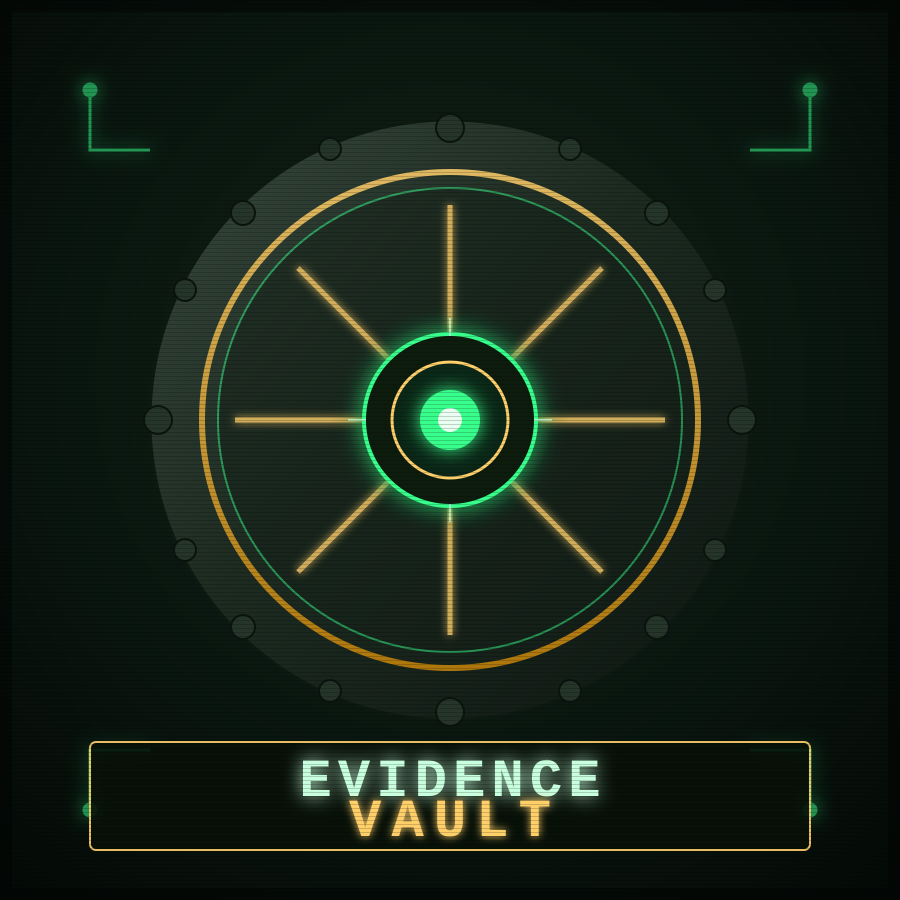

<p align="center">
  
</p>

<h1 align="center">EvidenceVault</h1>

<p align="center"><i>Fast, offline, zero-dependency batch encoding, bundling, renaming, and sorting for files, folders, and images — built for cyber-crime intelligence, DFIR, and OSINT workflows.</i></p>

<p align="center"><b>Runs anywhere Python 3.8+ runs:</b> Linux, Windows, macOS, and Termux (Android) — standard library only, no <code>pip install</code> required.</p>

---

## Why EvidenceVault

Investigators routinely need to encode large batches of evidence for transport/reporting, package a whole case folder into one self-contained artifact, rename messy dumps into a consistent evidence-naming scheme, and keep a defensible hash trail of everything they touch. EvidenceVault does all of that from one lightweight script, in parallel, with an audit trail.

## Features

| Category | What it does |
|---|---|
| **Multi-codec encoding** | Base64, Base64-URL-safe, Base32, Base16 (hex), Base85, ASCII85, and percent/URL-encoding |
| **Batch & parallel** | Encode/decode single files, whole folders, or nested trees, in parallel across CPU cores |
| **Image-safe** | Operates on raw bytes — works identically on `.jpg`, `.png`, `.pdf`, `.bin`, anything |
| **One-file vaults** | `bundle` compiles an entire folder into a single portable `.vault.json` — manifest + hashes + encoded payloads together |
| **Integrity built-in** | Every bundled file gets a SHA-256 hash recorded and re-checked on `verify`/`extract` |
| **Optional compression** | `--compress` shrinks payloads with zlib before encoding — smaller vaults, faster transfer |
| **Chain-of-custody hashing** | `hash` generates a SHA-256(+MD5) manifest of a folder as CSV or JSON |
| **Safe batch rename** | Template-driven renaming (`{name} {ext} {n} {hash} {date} {time} {parent}`) with cross-platform filename sanitization, collision handling, `--dry-run`, and a full original→renamed audit CSV |
| **Folder renaming** | Renames subfolders too (deepest-first, so paths never break mid-operation) |
| **Auto-sort** | Organizes a folder's contents into subfolders by extension, type (images/documents/archives/…), modification date, or detected encoding |
| **No telemetry, no network calls** | Everything runs locally against local files |

## Installation

No installation needed — it's a single file.

```bash
git clone <this-repo> evidencevault   # or just copy evidencevault.py
cd evidencevault
chmod +x evidencevault.py
python3 evidencevault.py --help
```

**Termux:**
```bash
pkg install python
python evidencevault.py --help
```

## Quick Start

```bash
# Encode every file under ./case_files (recursively) to Base64, 8 workers in parallel
python3 evidencevault.py encode ./case_files -e base64 -r -o ./encoded --workers 8

# Decode it back (auto-detects codec from the .b64/.b32/.hex/... extension)
python3 evidencevault.py decode ./encoded -r -o ./restored

# Compile a whole case folder into ONE hash-verified, compressed vault file
python3 evidencevault.py bundle ./case_files -e base64 -r --compress \
    --case "CASE-2026-0091" -o case_0091.vault.json

# Check every hash inside a vault without extracting anything
python3 evidencevault.py verify case_0091.vault.json

# Restore a vault to disk (re-verifies each hash as it writes)
python3 evidencevault.py extract case_0091.vault.json -o ./restored_case

# Chain-of-custody manifest (SHA-256 + MD5) for a folder
python3 evidencevault.py hash ./case_files -r --md5 -o manifest.csv

# Batch-rename a messy dump into a consistent evidence scheme (preview first!)
python3 evidencevault.py rename ./messy_dump -r \
    --pattern "EVID_{date}_{n:04d}_{hash}{ext}" --dry-run
python3 evidencevault.py rename ./messy_dump -r \
    --pattern "EVID_{date}_{n:04d}_{hash}{ext}" --audit-log rename_log.csv

# Sort a folder into subfolders by file category
python3 evidencevault.py sort ./inbox --by category -o ./sorted
```

## Command Reference

### `encode` / `decode`
```
evidencevault.py encode PATH... -e {base64,base64url,base32,base16,base85,ascii85,urlenc}
                                 [-r] [-o OUTPUT_DIR] [--compress] [--workers N]
evidencevault.py decode PATH... [-e ENCODING] [-r] [-o OUTPUT_DIR] [--decompress] [--workers N]
```
Each input file becomes one output file with the codec's extension appended (e.g. `photo.jpg` → `photo.jpg.b64`). `decode` auto-detects the codec from that extension unless `-e` is given.

### `bundle` / `extract` / `verify`
```
evidencevault.py bundle PATH... -o OUT.vault.json [-e ENCODING] [-r] [--compress] [--case NAME] [--minify]
evidencevault.py extract VAULT.vault.json -o OUTPUT_DIR [--force]
evidencevault.py verify  VAULT.vault.json
```
A vault is a single JSON file containing a manifest (relative path, codec, SHA-256, size, mtime) and the encoded payload for every input file. `extract` re-checks each hash while writing; `--force` writes anyway on a mismatch (and still reports it). `verify` checks everything with zero disk writes.

### `hash`
```
evidencevault.py hash PATH... [-r] [--md5] [-o manifest.csv|manifest.json]
```
Streams every file through SHA-256 (optionally MD5 too) for a defensible integrity manifest. Omit `-o` to print `sha256  path` pairs to stdout.

### `rename`
```
evidencevault.py rename PATH [-r] [--pattern TEMPLATE] [--start N] [--case {none,lower,upper,title}]
                              [--hash-length N] [--folders] [--dry-run] [--audit-log LOG.csv]
```
Template tokens: `{name}` original stem, `{ext}` original extension, `{n}` / `{n:04d}` sequential index, `{hash}` first N hex chars of the file's SHA-256, `{date}` `YYYYMMDD`, `{time}` `HHMMSS`, `{parent}` parent folder name. Names are sanitized for Windows/Linux/macOS compatibility (illegal characters stripped, reserved Windows device names avoided, trailing dots/spaces trimmed). Collisions are auto-suffixed. **Always run `--dry-run` first on real evidence.**

### `sort`
```
evidencevault.py sort PATH [-r] [--by {ext,category,date,encoding}] [-o OUTPUT_DIR] [--dry-run]
```
`category` buckets into `images/documents/archives/encoded/video/audio/other`; `encoding` buckets by which EvidenceVault codec produced the file; `date` buckets by `YYYY-MM` of last modification.

### Global flags (all subcommands)
`-v/--verbose` (debug logging), `--log-file PATH` (also log to file), `--timeout` (reserved for future use).

## Startup Banner

Every run prints a cyberpunk/retro-terminal vault banner (ANSI-colored ASCII art + a short "boot sequence") before the command executes — purely cosmetic, terminal-only.

- Auto-skipped when output isn't a real terminal (pipes, redirects, scripts never see it).
- Suppress explicitly with `--no-banner` (or `-q`) *before* the subcommand: `evidencevault.py --no-banner encode ...`
- Or set the environment variable `EVIDENCEVAULT_NO_BANNER=1` (also honors the standard `NO_COLOR` variable).
- Falls back to a compact one-line banner on narrow terminals (e.g. Termux in portrait mode).
- On legacy Windows `cmd.exe`, ANSI colors are enabled automatically — no extra setup needed.

## Design Notes

- **Pure standard library** — `base64`, `hashlib`, `zlib`, `json`, `concurrent.futures`, `argparse`, `pathlib`. Nothing to install, nothing to break on an air-gapped analysis box.
- **Parallelism** via `ProcessPoolExecutor`, scaled to `os.cpu_count()` by default — batch encoding scales with your cores.
- **Streaming hashes** — `hash_file()` reads in 1 MB chunks, so multi-gigabyte evidence images don't get loaded into memory whole.
- **Safety-first rename** — dry-run by default mindset, collision detection, and an optional CSV audit trail mapping every original path to its new name, so nothing is ever renamed without a paper trail.
- **Exit codes** — `0` success, `1` bad input/no files, `2` partial batch failure, `3` hash mismatch (verify/extract), `130` interrupted.

## License

MIT — use it, fork it, build on it.
